# CamperControl 3.12.1 für SYNC 3.4 / FMods

Reine QtQuick-2.6-App für den **Custom Apps Loader 2.3**. Sie benötigt keine native QNX-Binärdatei, keine Qt-WebSocket-Erweiterung und kein separates Desktop-QML-Projekt.

Dank an [Au{R}oN](https://syncdb.fmods.net/developers/auron89) (syncdb.fmods.net) für Custom Apps Loader.

## Voraussetzungen

- gejailbreaktes SYNC 3.4,
- FMods Tools 3.3 oder neuer,
- Custom Apps Loader 2.3,
- CamperControl-Node-RED-v4-Flow auf dem Cerbo GX,
- SYNC und Cerbo im selben erreichbaren WLAN.

## Installation

Den Inhalt des ZIPs in das Stammverzeichnis eines leeren USB-Sticks entpacken. Dort müssen `SyncMyMod` und `DONTINDX.MSA` liegen. Dieser eine Installer installiert die QML-App, registriert `com.jan.camper` in Version 3.12.1 und integriert gleichzeitig Transit-Symbol, globalen Root-Loader sowie den Kamera- und Parkpilot-Vorrang in die Ford-Statusleiste. Bei einem Upgrade wird der geprüfte Kamera-Sichtbarkeitsblock ohne Aufruf des Patch-Programms atomar ersetzt. Vor jeder Änderung werden App, `apps.json`, `Root.qml` und Statusleiste geprüft und gesichert. Bei einem unbekannten Ford-QML-Stand wird nichts verändert.

Version 3.12.0 ist ein **V2-only-Release**. V1 ist weder auswählbar noch im USB-ZIP enthalten; ein vorhandener V1-Wert in der lokalen Alt-Konfiguration wird ignoriert. Beim Upgrade entfernt der Installer nach dem vollständigen Rollback-Backup nur die exakt bekannten, nicht mehr referenzierten V1-Dateien. Die Ford-Systemseite und der obere Schließen-Knopf bleiben erhalten.

Die Außenlichtdarstellung verwendet für beide 560×360-Fahrzeugassets dieselben normierten Koordinaten wie die GX-Oberfläche. Fahrerseite: Frontbalken `(0,3000/0,1361)–(0,5661/0,1361)`, Seitenlampen `(0,6571/0,0944)` und `(0,8107/0,0972)`, Heckleuchte `(0,7714/0,0139)`. Beifahrerseite: Frontbalken `(0,4696/0,1000)–(0,7125/0,1139)`, Seitenlampen `(0,1125/0,1139)` und `(0,2625/0,1111)`, Heckleuchte `(0,0768/0,0139)`. Seitenlampen werden als kurze horizontale Lichtkörper, die Heckleuchte quadratisch und Front-/Fernlicht direkt innerhalb der langen Roof-Bar gezeichnet; die großzügigeren unsichtbaren Touchflächen bleiben davon getrennt.

## Auf dem Ford-SYNC-Display

CamperControl wird über das Camper-Symbol in der serienmäßigen SYNC-Oberfläche
geöffnet. Ford-Radio, Navigation, Telefon, Kameras und Parkpilot bleiben dabei
erhalten; der Schließen-Knopf führt aus CamperControl zurück zur Ford-Oberfläche.

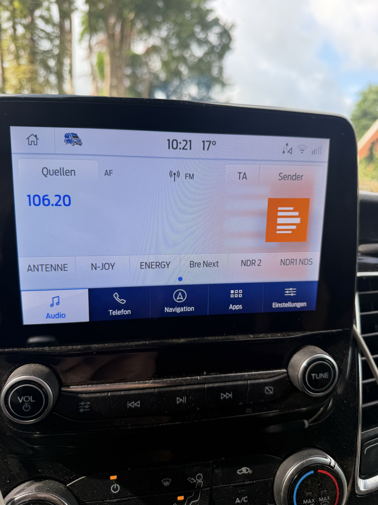

Die folgende Aufnahme zeigt die Lichtseite im realen Fahrzeug. Die Bedienung
bleibt auf die 800×480-SYNC-Anzeige abgestimmt und verwendet dieselben
Fahrzeug- und Lichtpositionen wie die GX-Referenz.

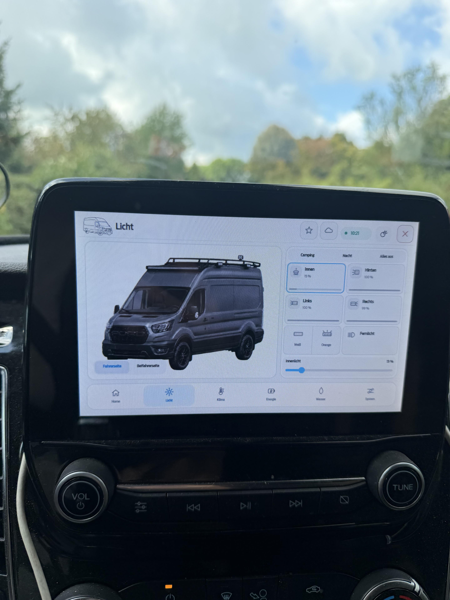

## Interaktive Galerie

Alle Bilder stammen aus dem lokalen 800×480-SYNC-QML-Preview. Die Bereiche
lassen sich auf GitHub einzeln auf- und zuklappen; jede Ansicht ist in Nacht-
und Tagmodus dokumentiert.

<strong>Home</strong>

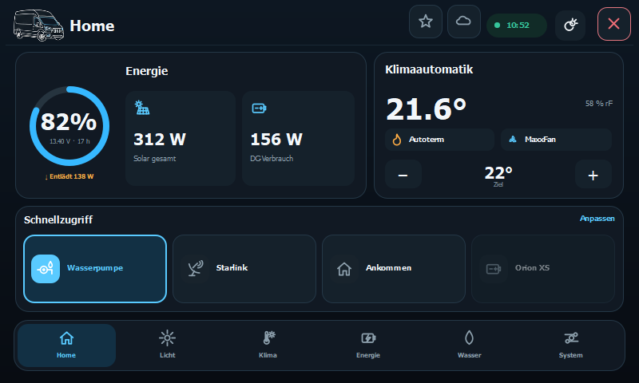

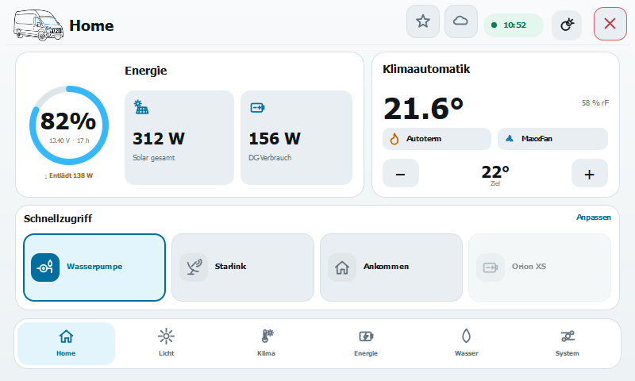

<strong>Licht – Fahrer- und Beifahrerseite</strong>

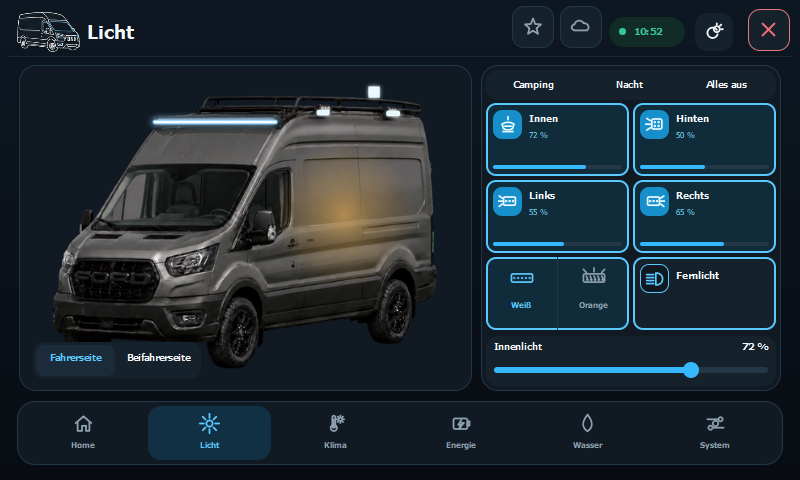

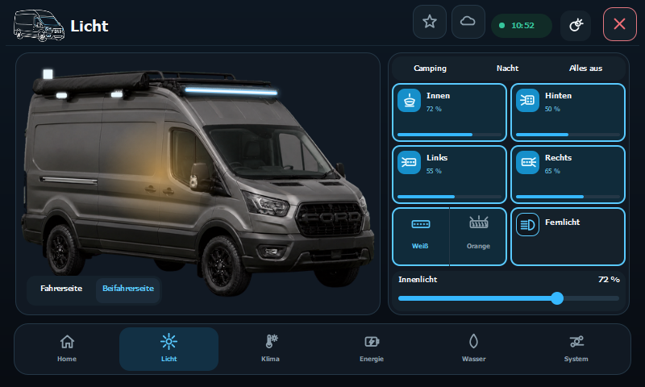

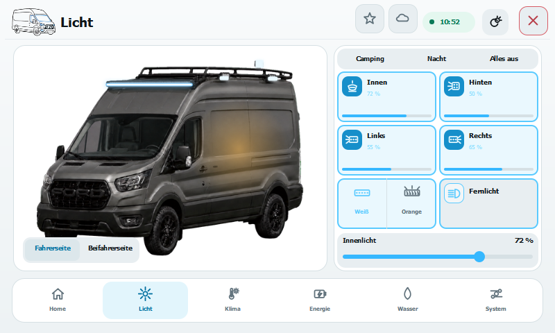

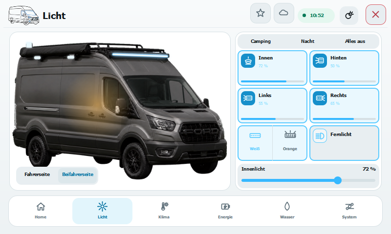

<strong>Klima</strong>

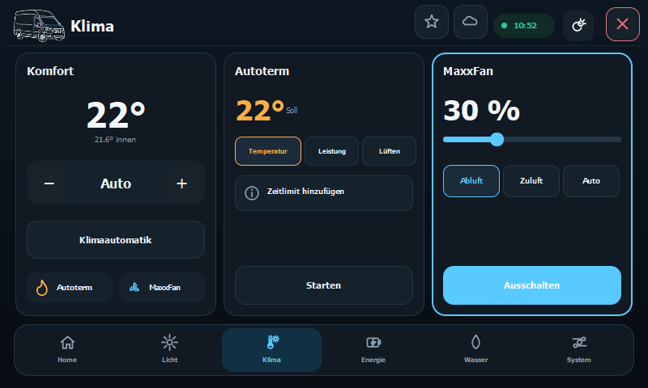

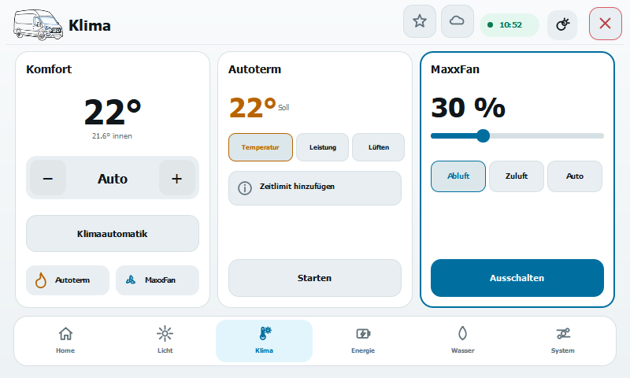

<strong>Energie – Verbraucher und Quellen</strong>

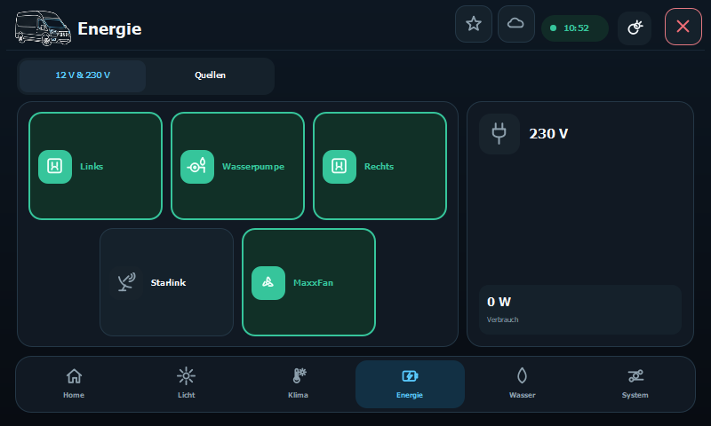

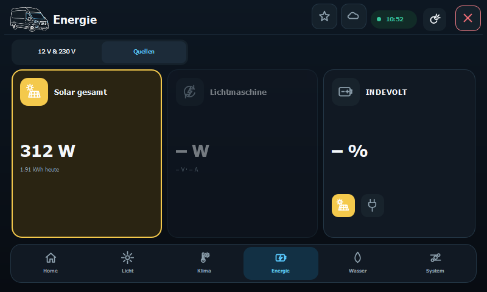

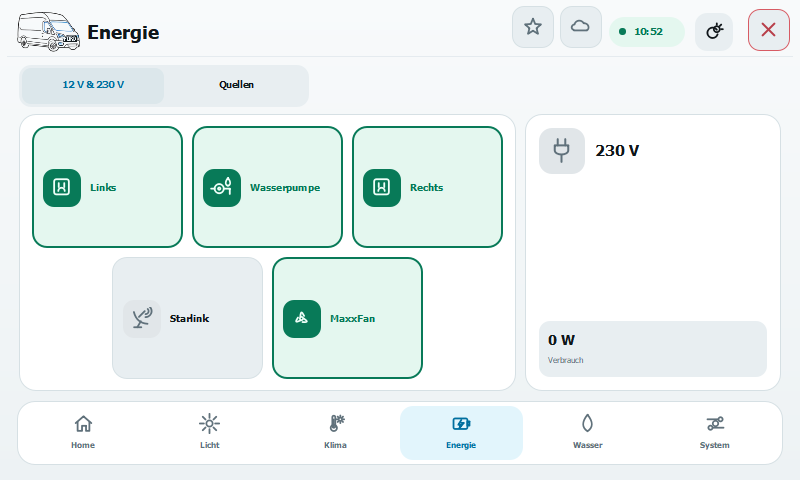

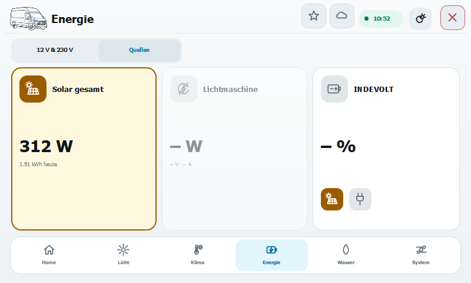

<strong>Wasser</strong>

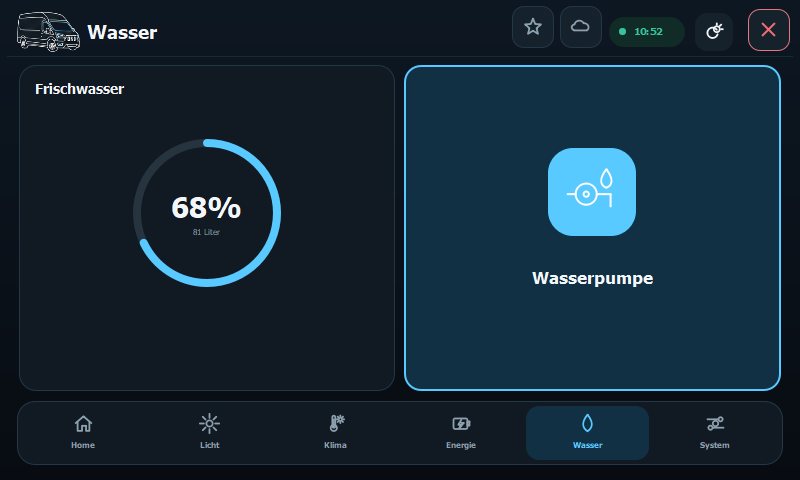

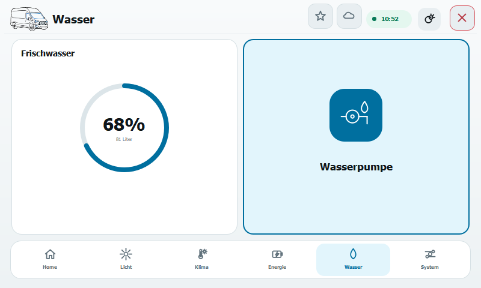

<strong>System</strong>

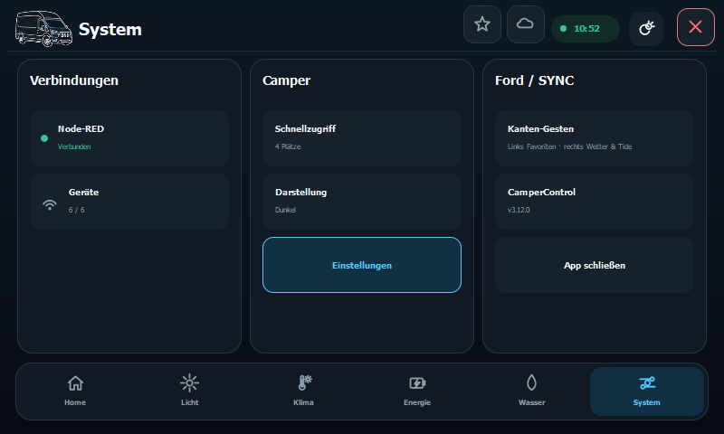

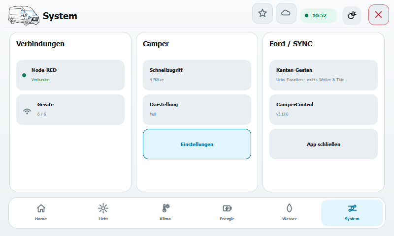

<strong>Favoritenpanel</strong>

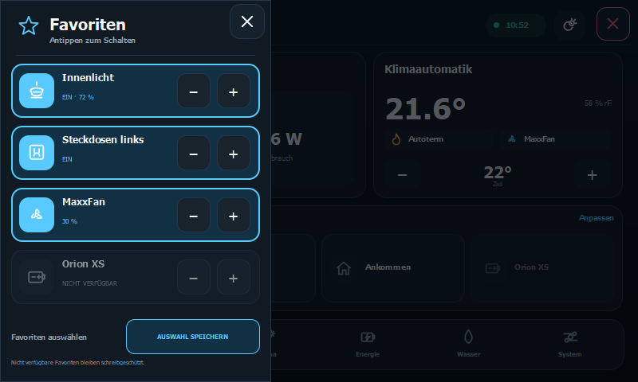

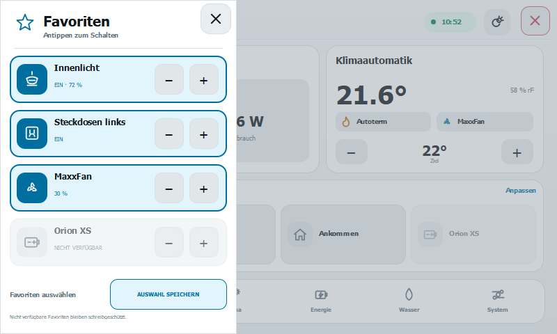

<strong>Wetter- und Tidepanel</strong>

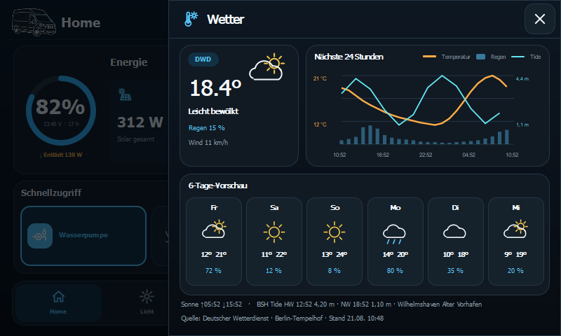

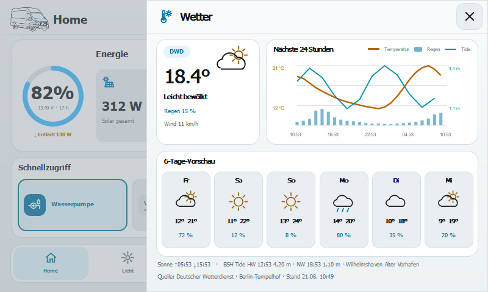

Alle Schaltabsichten laufen seriell über den einen `ApiClient`. Die Warteschlange ist auf acht Einträge begrenzt, schnelle Dimm-/Lüfterwerte werden zusammengefasst und Poll-, Einstellungs- und Befehlsabrufe teilen eine Busy-Sperre sowie eigene Vier-Sekunden-Watchdogs. Jeder lokale Befehl trägt `origin: "sync"`; Starlink Kanal 5 bleibt lokal vollständig ein- und ausschaltbar. Der Cerbo/Node-RED bleibt alleinige Daten- und Schutzinstanz. V2 verwendet nur einen gemeinsamen 1-Hz-Zeitgeber für die Uhr.

Zwei sichtbare 42-Pixel-Knöpfe direkt links neben der Uhr öffnen in V2 die vorhandenen Seitenpanels: der Stern die vom Backend aufgelösten Favoriten, das moderne Wolkensymbol das DWD-Wetter. Beide zeigen den offenen Zustand und wechseln über denselben gegenseitig ausschließenden Panel-State; sie senden selbst keinen API- oder Hardware-Befehl. Die unsichtbaren Kanten-Gesten bleiben zusätzlich erhalten: eine horizontale Wischbewegung vom linken 18-Pixel-Rand öffnet die Favoriten, vom rechten Rand das Wetter. Die Erfassung liegt nur zwischen Kopfzeile und Navigation (`y=56…390`), verlangt mindestens 48 Pixel horizontale Bewegung und klare horizontale Dominanz. Beide Seiten verwenden denselben Overlay-Host, denselben Hintergrund-Scrim und denselben 48-Pixel-Schließen-Knopf; es gibt keinen sichtbaren Griff.

Home-Schnellzugriff und Favoriten sind getrennte Verträge. Home liest ausschließlich `snapshot.ui.quickAccess` und wird über `ui.quickAccessIds` konfiguriert. Das Sternpanel liest ausschließlich `snapshot.ui.favorites`; seine lokale Auswahl stammt aus `ui.favoriteIds` und wird als `{ui:{favoriteIds:[…]}}` gespeichert. Nur `snapshot.ui.quickAccessOptions` dient beiden Editoren als gemeinsamer Auswahlkatalog. Fehlende Favoriten bleiben leer und fallen niemals auf Home zurück; es gibt keine im Produkt hartcodierte Favoritenbelegung. Ein Favoritenbefehl wird nur weitergereicht, wenn der aufgelöste Eintrag ausdrücklich `available: true` sowie ein vollständiges `command.target` und `command.action` enthält.

Das 560 Pixel breite Wetterpanel liest ausschließlich den zentral vom Cerbo erzeugten `snapshot.weather`; die QML-App ruft weder den DWD noch einen anderen HTTP-Dienst auf. Der Vertrag ist Schema 1 mit `source`, `attribution`, `station`, `modelRunUtc`, `fetchedAtUtc`, `stale`, `timezone`, `sun.riseUtc/setUtc`, `hourly` und `daily`. Dargestellt werden exakt 24 Stunden auf einer gemeinsamen Zeitachse als Temperatur-/Niederschlagschart und sechs Tage als kompakte Leiste. Stundenwerte verwenden `t`, `tempC`, `precipProbabilityPct`, `precipMm`, `icon` und `windKmh`; Tageswerte `date`, `minC`, `maxC`, `precipMm`, `maxHourlyPrecipProbabilityPct` und `icon`. Optional wird `weather.tides` defensiv als BSH-Datensatz mit Station, `updatedUtc`, `stale`, `referenceLevel: "PNP"`, `nextHigh` und `nextLow` angezeigt. Eine optionale, streng validierte `curve` mit zwei bis höchstens 27 aufsteigend sortierten `{t,heightM}`-Punkten erscheint auf derselben 24-Stunden-Achse als cyanfarbene Tide-Linie mit eigener Min-/Max-Skalierung. Die 27 Punkte bestehen aus 25 ressourcenschonend gewählten Kurvenpunkten sowie dem interpolierten Start- und Endwert; Hoch-/Niedrigwasser-Extrema bleiben erhalten. Temperaturwerte einschließlich Minusgraden und Tidehöhen erhalten getrennte numerische Y-Skalen. Ungültige oder fehlende Tide-Daten bleiben vollständig verborgen; Höhen werden ausdrücklich als Meter über Pegelnullpunkt behandelt. Fehlwerte bleiben Striche; erfundene Ersatzwerte gibt es nur im Preview-Harness. `Quelle: Deutscher Wetterdienst` bleibt dauerhaft sichtbar.

In den SYNC-Einstellungen werden Wetter und Tide unabhängig aus denselben
benannten Listen wie in GX/WASM und Node-RED gewählt. Standard ist jeweils
`GPS / automatisch`; Wetter verwendet bei fester Auswahl eine DWD-ID, Tide nur
eine kuratierte echte BSH-Nordseestation. Ohne GPS oder nahe Küstenstation bleibt
die Tide über den Wilhelmshaven-Fallback sichtbar. Die Auswahl wird erst beim
Speichern als begrenzter gemeinsamer `weatherLocation`-Patch an den Cerbo
gesendet; SYNC speichert weder GPS-Koordinaten noch einen eigenen Standort.
Quellen-, Verarbeitungs- und Lizenzhinweise stehen unaufdringlich am Ende der
Einstellungsseite.

Das reproduzierbare V2-only-Archiv wird mit `python tools/build_release.py` unter `dist/CamperControl-SYNC3-v3.12.1.zip` erzeugt. Der Builder verwendet für das App-Verzeichnis eine feste Positivliste und prüft damit gleichzeitig, dass keine V1-QML oder alten Fahrzeugbilder in das ZIP gelangen. Zusätzlich enthält das Archiv ein POSIX-`cksum`-Manifest über jeden anderen ZIP-Eintrag; der Geräte-Preflight prüft damit Pfad, Größe und Prüfsumme vollständig, bevor er Ford-Dateien verändert. Fehlgeschlagene Installationen verwenden einen separaten Transaktions-Snapshot. Die ursprünglichen Ford-Dateien liegen als schreibgeschützter, nicht bei Upgrades überschriebener Restore-Vertrag unter `/fs/rwdata/fmods/mods/camper-complete/original`.

Version 3.12.1 ergänzt den zentralen AUTOTERM-Kälteschutzschalter unter Einstellungen mit Start-/Stopptemperatur, Heizstufe und festem Ruuvi-B7B8-Bodensensor. CamperControl-Meldungen sind ein bestätigungsfreier Verlauf; der Cerbo speichert nur die letzten 25 Einträge.

Version 3.11.1 passt V2 an die reale 800 × 480-SYNC-Anzeige an: Der Tag-/Nacht-Hintergrund reicht ohne künstlichen dunklen Rundrahmen bis in alle vier Displayecken, das Transit-Liniensymbol ist transparent freigestellt und trägt den kompakten FORD-Grill. Der obere rechte Knopf schließt die App über den vorhandenen Ford-/FMods-Rückweg; Einstellungen bleiben über `System` erreichbar.

Version 3.11.0 portierte den aktuellen **Transit-Horizon-V2-Prototyp** als native QtQuick-2.6-Oberfläche für 800 × 480 Pixel. Die damals noch vorhandene V1-Auswahl ist seit 3.12.0 entfernt.

Version 3.10.0 führte historisch die Auswahl zwischen Design V1 und V2 ein; diese Auswahl gehört nicht mehr zum aktuellen V2-only-Release.

Version 3.9.3 ergänzt für alle dimmbaren Lichtkacheln eine getrennte Bedienung: Die Kachel schaltet direkt An/Aus, der schmale Dimm-Balken öffnet einen großen horizontalen Regler mit Voreinstellungen. Die Orion-XS-Umwandlungsanzeige, Einstellungen sowie Kamera- und Parkpilot-Vorrang bleiben vollständig enthalten.

Version 3.9.4 ergänzt auf der Energie-/INDEVOLT-Seite die lokale Freigabe der 230-V-Stromzufuhr zum Campernetz über einen vom Cerbo nativ eingebundenen Shelly 1PM Gen4. Der Schalter und seine Messwerte erscheinen nur, wenn der D-Bus-Dienst tatsächlich verfügbar ist.

Version 3.9.9 ergänzt die aktuelle Cerbo-Ethernet-Adresse als unsichtbaren API-Fallback. Damit findet die App Node-RED sowohl direkt über den Cerbo-Access-Point als auch aus dem gemeinsamen Fahrzeug-/Starlink-LAN. Version 3.9.8 entfernte den alten RVC-Statusleisten-Knopf einschließlich Icon, Touch-/Drag-Logik und Statusleisten-Kamerabefehl vollständig; Rückfahrkamera, Frontkamera und Parkpilot in `Root.qml` bleiben unverändert. Das 46-Pixel-Transit-Symbol übernimmt dessen gespeicherte frühere Position mit einer eigenen 60 × 54 Pixel großen Touchfläche. Der App-Wechsel erfolgt nach einem abgeschlossenen Klick über einen kurzen Timer. Das Upgrade erfolgt über einen begrenzten atomaren Dateitausch mit automatischem Rollback und verwendet keinen interaktiven Patch-Aufruf.

Version 3.7.9 nimmt den gesamten sichtbaren Camper-Bildschirm als eigene Touchfläche an. Berührungen auf freien Flächen oder zwischen Bedienelementen können dadurch nicht mehr zusätzlich Radio-, Klima- oder Navigationsknöpfe der darunterliegenden Ford-Oberfläche auslösen. Während Kamera und Parkpilot die Camper-App ausblenden, ist diese Touch-Abschirmung ebenfalls vollständig inaktiv.

Version 3.7.8 entlastet die alte SYNC-Hardware durch einen ruhigen, dauerhaft laufenden Hintergrundabruf. Unmittelbar nach Schaltbefehlen werden mehrere kurze Bestätigungsabfragen ausgeführt, sodass Licht und 12-V-Ausgänge weiterhin schnell reagieren, ohne dass sich HTTP-Verbindungen und große Zustandsantworten aufstauen.

Version 3.7 bildet die tatsächliche STAR-Power-Verkabelung ab. Ausgang 3 schaltet den Zusatz-Fernlichtbalken; Cerbo-Digitaleingang 4 liefert zusätzlich dessen Fahrzeug-Fernlichtzustand. Die serienmäßigen Ford-Scheinwerfer werden weder geschaltet noch beleuchtet dargestellt. Kanal 7 ist der weiße Tagfahrlicht-Streifen im Balken, Kanal 8 der orange Warnlicht-Streifen; dessen Blinkrhythmus erzeugt Node-RED ausschließlich per Ein/Aus. Die Lichtseite verwendet große Schaltflächen und direkt bedienbare Helligkeitsregler. Die Fahrerseite wird ohne Markise im Vordergrund gezeigt; auf der Beifahrerseite liegt die Markise sichtbar im Vordergrund. Autotherm und MaxxFan werden über ihre Gerätebeschriftung geöffnet. Die Temperaturseite zeigt alle verfügbaren Messwerte. Ihre unabhängige Raumklima-Automatik kann je nach Innenraumtemperatur AUTOTERM oder MaxxFan anfordern. Separat schützt die CPU-Lüftung den Cerbo anhand seiner eigenen SoC-/CPU-Temperatur und schaltet dafür Relais 1 (Abluft) und Relais 2 (Zuluft). Zusätzlich kann der gemeinsame Lüfterlauf in SYNC manuell ein- und ausgeschaltet werden. Die Solar-/INDEVOLT-Kachel öffnet alle Victron-MPPTs und INDEVOLT-Geräte. Unten stehen nur HOME, LICHT und 12/230; Meldungen und Service liegen in den Einstellungen. Befehlsdetails bleiben im Ereignis- und Diagnoseprotokoll verfügbar, ohne die Bedienung zu verdecken. Die Batterieleistung kommt wie in GX zentral aus `com.victronenergy.system /Dc/Battery/Power` und wird vom Cerbo als `energy.battery.power` an SYNC geliefert; dadurch ist die Anzeige nicht an eine feste SmartShunt-Instanz gebunden. Die Batteriedetails zeigen außerdem Hauptbatterie, Messung 2/Starterbatterie, Strom, Verbrauch, Restzeit und Kapazität.

Unter `SETTINGS` können Innenlicht sowie die fünf Außenleuchten frei und ohne Doppelbelegung den dimmbaren STAR-Power-Kanälen 7–12 zugeordnet werden. Die Zuordnung wird dauerhaft im Cerbo gespeichert.

Nach dem Neustart: **Apps → Custom Apps → Camper**. Über `SETTINGS` kann bei Bedarf die Cerbo-Adresse eingetragen werden. Ein Token wird nicht benötigt. Eine reine IP genügt; die App ergänzt `http://`, Port `1880` und `/camper/api/v2` automatisch:

- Cerbo-Access-Point: `172.24.24.1`
- Starlink/anderes WLAN: beispielsweise `192.168.1.42`

Die Konfiguration liegt unter `/fs/rwdata/fmods/mods/camper/config.json`.

## Funktionen

- SmartShunt, Victron-Solar, INDEVOLT, Wasser, AUTOTERM, MaxxFan und MultiPlus Compact
- AUTOTERM Start/Stopp, Temperatur-, Leistungs- und Lüftungsmodus sowie die im seriellen Bestand vorhandenen Schutz- und Wartungseinstellungen
- eigene Seite für sechs STAR-Power-Lichtkreise; fünf davon dimmbar, Warnlicht als reines Blinksignal
- eigene Seite „12/230 V“ für MultiPlus, 12 V links/rechts, Wasserpumpe, manuelles Fernlicht, Starlink und MaxxFan-Versorgung
- frei konfigurierbare Szenen
- physisch bestätigte Befehle im Diagnoseprotokoll, ohne störende Einblendung über der Bedienoberfläche
- bestätigungsfreier Alarm- und Ereignisverlauf mit maximal 25 gespeicherten Meldungen
- Geräteverbindungen, Abbrüche und Antwortzeiten
- Verlauf, Batterie-/Wasserprognose und Wartungsplan
- keine zündungs-, geschwindigkeits- oder gangabhängigen Bediengrenzen

Die App wählt die erreichbare Cerbo-Verbindung automatisch aus der gespeicherten Adresse, dem Victron-AP, `venus.local`, `einstein` und `einstein.local`. Die konkrete Netzart bleibt unsichtbar; angezeigt werden nur `Verbunden` oder `Keine Verbindung`.

Die App fragt den gemeinsamen Zustand alle 1,5 Sekunden über die einzige aktuelle HTTP-v2-Schnittstelle ab; nach einem Befehl folgen höchstens fünf kurze Bestätigungsabfragen. Alte HTTP-v1- und ungenutzte WebSocket-Endpunkte sind nicht mehr enthalten. Schutzfunktionen des Geräts bleiben erhalten: insbesondere AUTOTERM-Nachlauf/Unterspannung und die hardwareseitige STAR-Power-Absicherung.

## Statusleisten-/Root-Integration

Sie ist Bestandteil desselben `SyncMyMod`-Installers. Unterstützt werden die geprüfte originale Ford-Datei, die ältere Camper-Integration und der bereits aktuelle Stand. Bei Rückfahr- oder Frontkamera bleibt die App geladen, wird aber für die gesamte Vollbild-Kameraansicht unsichtbar und erscheint danach auf derselben Seite wieder.

## Haftungsausschluss zu Ford

Ford, FORD, das Ford-Logo sowie SYNC sind Marken von Ford Motor Company bzw. ihren Partnern.
Diese App ist unabhängig von Ford entwickelt, steht nicht unter offizieller
Freigabe oder Wartung von Ford/FMods und wird auf eigene Gefahr in
modifizierten Fahrzeugumgebungen verwendet.

Die Integration nutzt die vom Benutzer bereitgestellte SYNC-/FMods-Umgebung;
für sicherheitsrelevante Fahrzeugfunktionen, Haftungsfragen oder Schäden am
Fahrzeug ist ausschließlich der Fahrzeughersteller bzw. die verantwortliche
Werkstatt/Instanz zuständig. Der Einsatz in Navigations-, Kamera- oder
Assistenzfunktionen erfolgt ohne Einfluss auf fahrzeugseitige
Sicherheitsmechanismen.

## Entfernen

Im Custom Apps Loader die Camper-Kachel lange drücken und die Löschung bestätigen. Dessen `app_delete.sh` ruft das mitgelieferte `uninstall.sh` auf und entfernt anschließend App-Eintrag und App-Ordner.

## Lizenz

Der originale CamperControl-Code dieses Repositories steht unter der
[PolyForm Noncommercial License 1.0.0](LICENSE.md). Kommerzielle Nutzung ist
nicht erlaubt. Ford-/FMods-Bestandteile, Bilder, Produktnamen und anderes
Drittmaterial bleiben von dieser Lizenz ausgenommen; Einzelheiten stehen in
[NOTICE.md](NOTICE.md). Aus Lucide abgeleitete Navigationssymbole behalten ihre
[ISC-/MIT-Lizenz](LICENSE-LUCIDE.txt). Die separat unter CC BY 4.0 stehenden
DWD-/BSH-Daten sind in [DATA-LICENSES.md](DATA-LICENSES.md) dokumentiert.
